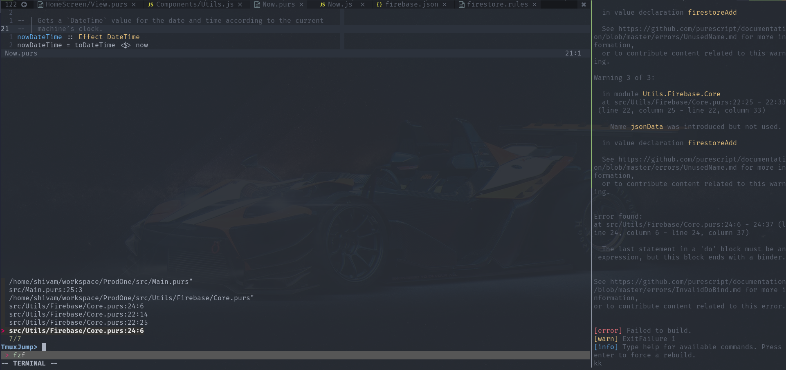
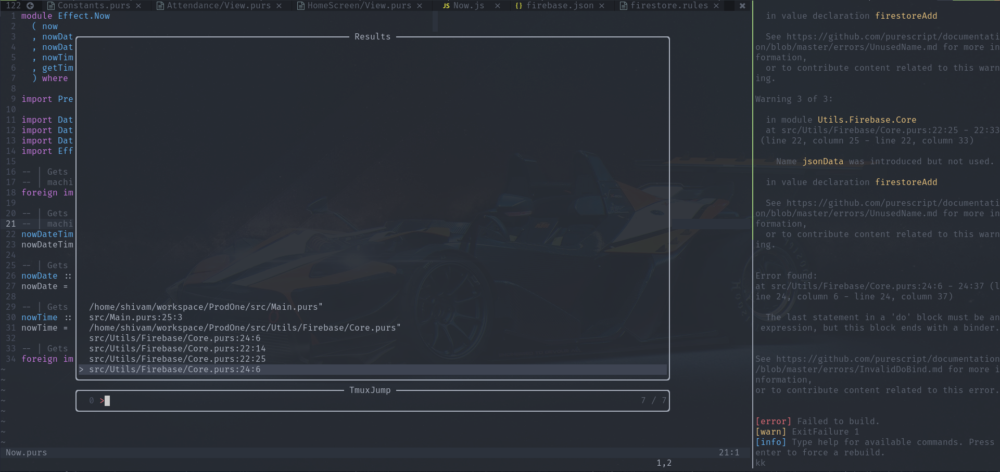

# tmuxjump.vim

A plugin to open file from file paths printed in sibling tmux pane. 

## Usecase

In my code flow, I open nvim in one tmux pand and in another I run compiler on 
watch. And as I code, it outputs any error/warning in the pane which contains 
exact location of error ex. `src/Main.purs:29:1`. Unlike Vscode I can't directly
click on the path and open it in vim. So I created this plugin, which basically 
greps all the file path printed on sibling panes and populates them in fzf 
window. And then I can decide and jump to that location easily without moving 
out of nvim.

### With Fzf.vim


### With Telescope.nvim



[Demo video](https://www.youtube.com/watch?v=Wo1E1z257GA)

## Install

### Dependencies

This plugin is dependent on following
- [Fzf.vim](https://github.com/junegunn/fzf.vim)
- [tmux](https://github.com/tmux/tmux/wiki)
- (Optional) [Telescope.nvim](https://github.com/nvim-telescope/telescope.nvim) 

### Installation

Use your favorite plugin manager.

Using [vim-plug](https://github.com/junegunn/vim-plug):

  `Plug 'shivamashtikar/tmuxjump.vim'`

Using [vundle](https://github.com/gmarik/Vundle.vim):

  `Plugin 'shivamashtikar/tmuxjump.vim'`

Using [neobundle](https://github.com/Shougo/neobundle.vim):

  `NeoBundle 'shivamashtikar/tmuxjump.vim'`

With [pathogen.vim](https://github.com/tpope/vim-pathogen), just clone this repository inside `~/.vim/bundle`:


## Configuration

Plugin exposes two commands `TmuxJumpFile` & `TmuxJumpFirst` 

 * `TmuxJumpFile` will list files paths in fzf window
 * `TmuxJumpFirst` will jump to the first instance of the file (from bottom)
 * These command also take string as a param, which will be used to filter only 
 the required files and then populate/jump  location

Map a keybinding to trigger plugin

  ```
  nnoremap <leader>ft :TmuxJumpFile<CR>
  nnoremap <leader>; :TmuxJumpFirst<CR>
  ```
for Specific FileType, you can update keybinding using below command. So, when you're
in purescript buffer, it'll only look for paths which contain `purs` string

  ```
  autocmd FileType purescript nnoremap <leader>ft :TmuxJumpFile purs<CR>
  autocmd FileType purescript nnoremap <leader>; :TmuxJumpFirst purs<CR>
  ```

Plugin by default uses fzf for listing files in window. However it supports Telescope.nvim
too, which can be enabled by setting below variable in vimrc

  ```
  let g:tmuxjump_telescope = v:true
  ```

